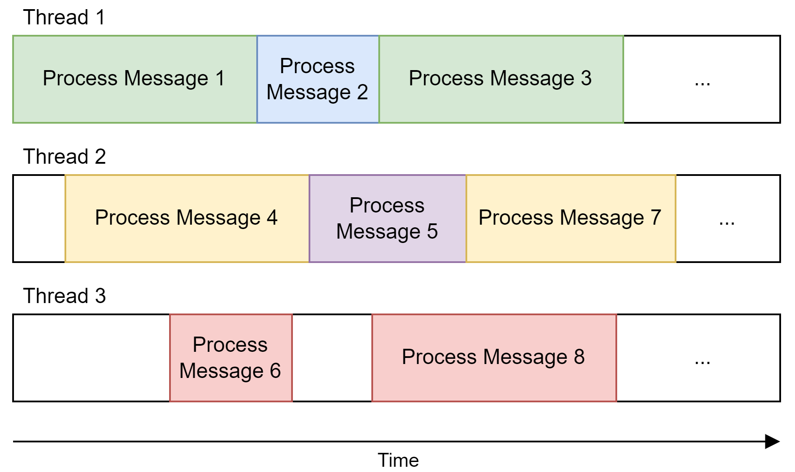
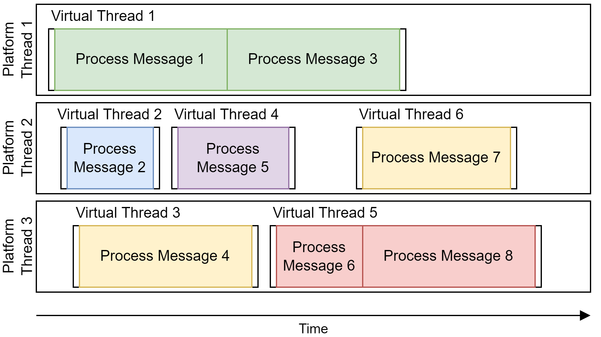
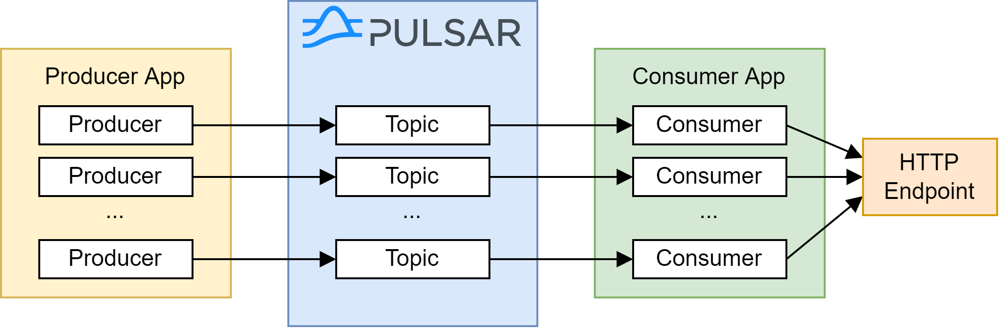

# Pulsar Virtual Threads Message Listener

This project explores using virtual threads for message processing in a Key_Shared subscription in [Apache Pulsar](https://pulsar.apache.org/), optimizing for scenarios where processing a single message may take hundreds of milliseconds and involves IO while preserving message ordering.

## Introduction

### Message Listener

In Pulsar, the `MessageListener` interface provides a push-based mechanism for consuming messages.
When a message arrives, the `MessageListener` is triggered and receives the message.
Here's an example of how to use it:

```java
Consumer consumer = client.newConsumer()
     .topic("topic")
     .subscriptionName("subscription")
     .messageListener((c, msg) -> {
         // process the message
     })
     .subscribe();
```

### Message Listener & Key_Shared Subscription

Pulsar supports [four subscription types](https://pulsar.apache.org/docs/4.0.x/concepts-messaging/#subscription-types).
This experiment focuses on the `Key_Shared` subscription, where multiple consumers can attach to the subscription, and messages with the same ordering key are delivered to the same consumer.

When using a `Key_Shared` subscription with a `MessageListener`, messages are processed by multiple executors.
The message order is preserved because messages with the same ordering key are handled by the same executor.

By default, the `MessageListener` uses a thread pool of the Pulsar client.
With [PIP-359](https://github.com/apache/pulsar/blob/master/pip/pip-359.md), Pulsar supports custom message listener executors.

### Single-Threaded Executor

When using a single-threaded executor for the message listener, only one message can be processed at a time.
While this ensures messages are processed in order, the throughput is limited by the time it takes to process a single message.


In the example above, assume all messages arrive at the consumer nearly at the same time.
If all messages have the same ordering key, they must be processed sequentially, which prevents any speedup in processing.
If they have different ordering keys, message 2 and 3 unnecessarily need to wait.

### Multi-Threaded Executor with Platform Threads

Using a multi-threaded executor allows for concurrent processing of multiple messages.
By ensuring that messages with the same ordering key are processed by the same thread, we can guarantee message ordering.
We have an increased throughput compared to a single-threaded executor, as messages with different ordering keys can be processed concurrently.



In the example above, three threads are used.
Messages with the same ordering key are represented in the same color.
The message number indicates the order in which messages are received by the consumer.
One can see that for example message 3 might unnecessarily need to wait for message 2 to be processed even though they have different ordering keys.
Also message 6 is processed before message 5, even though message 5 was received earlier.
What also can be seen is that thread 2 and 3 are idle at some point.

### Limitations of Multi-Threaded Executor with Platform Threads

Let's assume we need to subscribe to hundreds or thousands of topics and the message processing time varies.
Then, we will have hundreds or thousands of consumers.
While messages of one topic are processed within milliseconds, messages of another topic may take up to a few seconds.
We could use one large thread pool and share it among the consumers, but this could mean that messages of one topic are blocked/delayed by messages of another topic.
Let's assume topic `A` and topic `B` receive messages and their ordering keys are mapped to the same thread.
Then, the message of one topic needs to wait until the message of the other topic is processed.

If we do not use a shared thread pool, but individual thread pools for each consumer, then we could run out of threads.

## Goal

The experiment aims to improve fairness between topics by leveraging virtual threads.
A message should not need to wait for a message of a different topic to be processed and should only need to wait for another message of the same topic if they have the same ordering key.

## Approach

The `MessageListener` interface is used with a custom message listener executor.
One executor instance is created for each consumer.
It will map each ordering key to one virtual thread that will process messages with this ordering key.
If a message is received, the executor creates a new virtual thread that processes the message.
If another message with the same ordering key is received, the executor will submit it to the same virtual thread.
If a message with a different ordering key is received, the executor will create a new virtual thread.
Once all messages assigned to a virtual thread are processed, the virtual thread will be terminated to free resources.



The example above shows the same messages as in the previous example.
Message 1 is received and a new virtual thread is created for the green ordering key.
While message 1 is processed, message 2 and 3 are received.
Since message 2 has a different ordering key, a new virtual thread is created.
This virtual thread can be scheduled on a different platform thread.
Message 3 has the same ordering key as message 1, so it is submitted to virtual thread 1 and processed after message 1.
In this way, ordering is guaranteed.

In the case of the yellow ordering key, message 7 arrives after message 4 is processed.
Therefore, the virtual thread 3 was already terminated and a new virtual thread is created for the yellow ordering key and message 7.

In comparison to the previous example, all messages except message 6 and 8 are processed as early as possible.
Message 6 and 8 show that the number of platform threads is still a limiting factor and if all platform threads are busy, messages may need to wait.

If the message processing involves IO operations, the virtual thread may even be suspended and another virtual thread can be scheduled on the same platform thread.
This may further increase the throughput.

## Usage

Add the GitHub packages repository to your `pom.xml`:
```xml
<repository>
  <id>github</id>
  <url>https://maven.pkg.github.com/pdolif/pulsar-virtual-threads-message-listener</url>
</repository>
```
Note: GitHub packages requires authentication.

Add the following dependency to your `pom.xml`:
```xml
<dependency>
    <groupId>com.github.pdolif</groupId>
    <artifactId>pulsar-virtual-threads-message-listener</artifactId>
    <version>1.0.0</version>
</dependency>
```

Create a `KeySharedExecutor`:
```java
var messageListenerExecutor = new VirtualThreadKeySharedExecutor("name");
```
In this example, a `VirtualThreadKeySharedExecutor` is used, which executes the message listener on virtual threads.

Use the message listener executor when creating a consumer:
```java
pulsarClient.newConsumer()
    .subscriptionType(SubscriptionType.Key_Shared)
    .messageListener((consumer, msg) -> {
        // process and acknowledge the message
    })
    .messageListenerExecutor(messageListenerExecutor)
    ...
    .subscribe();
```

### Metrics

To collect metrics using Micrometer, provide a `MeterRegistry` to the `VirtualThreadKeySharedExecutor`:
```java
var messageListenerExecutor = new VirtualThreadKeySharedExecutor("name", Metrics.with(meterRegistry));
```

## Evaluation

### Scenario

To evaluate the approach, a producer application, a consumer application, and an HTTP endpoint were used.
The consumer application consumes messages and forwards them to the HTTP endpoint.
The endpoint applies a delay before it responds.
The applications were implemented using Java 21 and Spring Boot 3.3.5.



The producer used a fixed number of random UUIDs as ordering keys.
Messages were produced at a fixed rate and for each message an ordering key was randomly selected from the fixed set of UUIDs.
Each message contained the creation timestamp and a 10kb payload.

The end to end time from message creation until the message is received by the HTTP endpoint (inclusive delay) was measured.
Each test was executed for 120 seconds and a single instance of the consumer application was running.
The consumer application used one Pulsar consumer per topic.

### Environment

The applications were deployed on a microk8s instance running version v1.32.3.
The host system was equipped with an Intel Core Ultra 7 265K CPU, 64GB of DDR5 RAM, and a Samsung 990 EVO Plus SSD.
The Pulsar cluster (version 4.0.4) was running on the same microk8s instance.

The Pulsar Helm chart was used with the default configuration, except that anti affinity and journaling were disabled.
The consumer receiver queue size was set to 1000/default and a Key_Shared subscription was used.

### E2E time p50/p90/p99 (100 topics, single partition, 100 ordering keys)

| Producer Message Rate/<br/>Endpoint delay | 10ms                 | 100ms                      | 500ms                       |
|-------------------------------------------|----------------------|----------------------------|-----------------------------|
| 3 messages/s per topic                    | 12-13/13-14/13-14ms  | 102-103/103/103-104ms      | 502-503/503-504/504-670ms   |
| 5 messages/s per topic                    | 12-13/12-14/13-14ms  | 102-103/102-104/103-104ms  | 502-503/502-504/512-804ms   |
| 10 messages/s per topic                   | 11-13/12-13/12-14ms  | 101-103/102-103/103-104ms  | 501-503/502-504/802-903ms   |
| 20 messages/s per topic                   | 11-12/12-13/12-14ms  | 101-103/102-103/115-153ms  | 501-503/504-553/903-1053ms  |


### E2E time p50/p90/p99 (500 topics, single partition, 100 ordering keys)

| Producer Message Rate/<br/>Endpoint delay | 10ms                 | 100ms                      | 500ms                      |
|-------------------------------------------|----------------------|----------------------------|----------------------------|
| 3 messages/s per topic                    | 12/12-13/13-42ms     | 102/102-103/103-130ms      | 502/502-503/503-670ms      |
| 5 messages/s per topic                    | 11-12/11-13/12-14ms  | 101-102/101-103/106-134ms  | 501-502/501-503/539-803ms  |